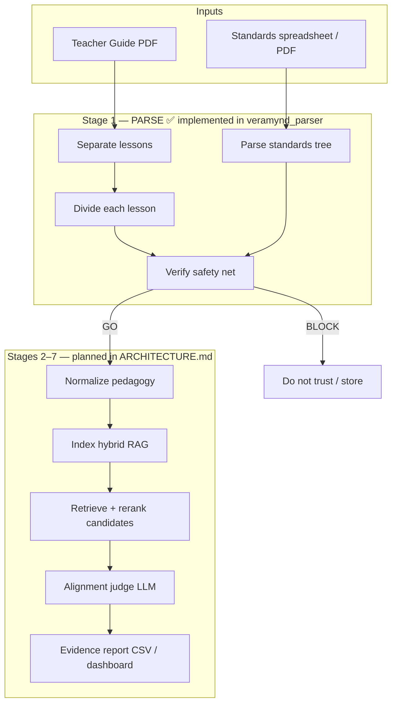
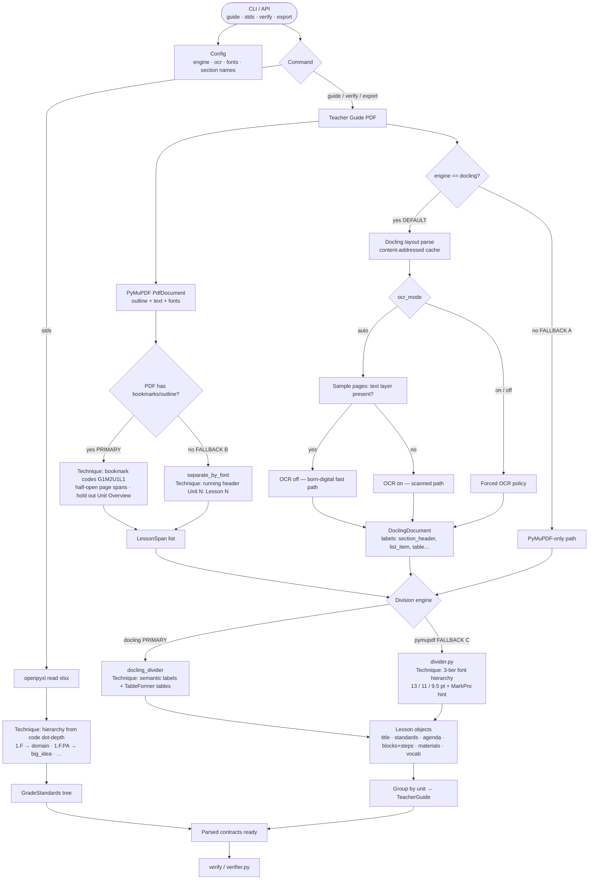
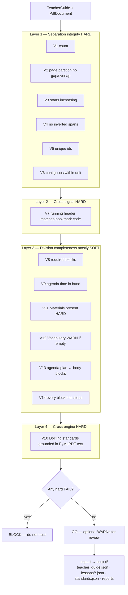
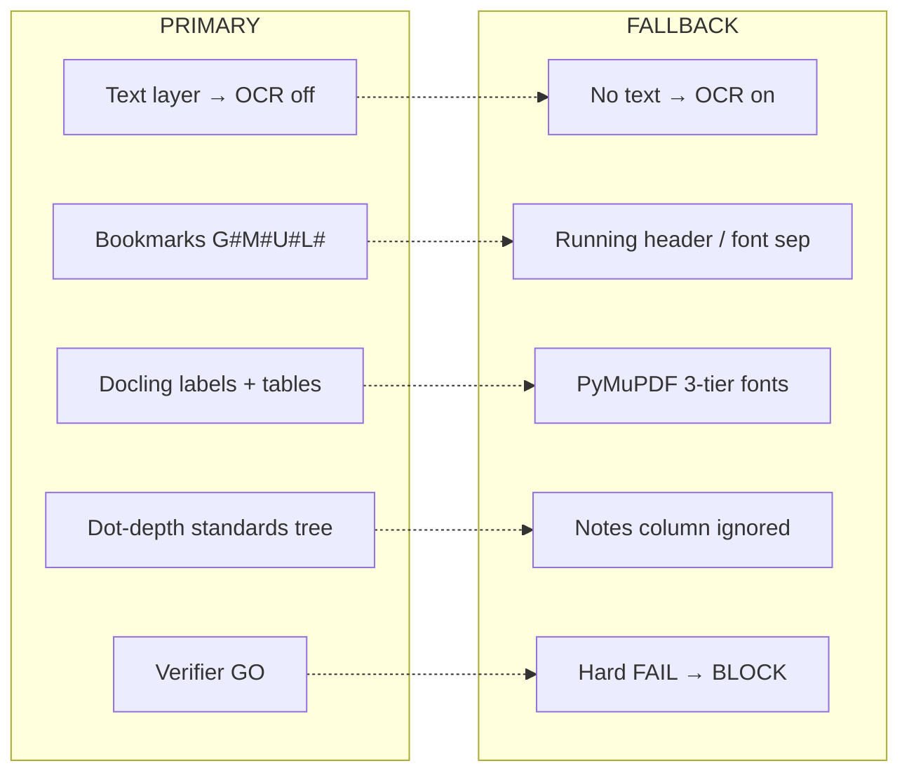

# Veramynd — Complete Project Flow
## Official Technical Documentation

| | |
|---|---|
| **Document** | Veramynd Complete Project Flow |
| **Audience** | New developers, AI engineers, software engineers, reviewers, interviewers |
| **Scope today** | The full pipeline is **implemented**: Stage 1 parse/verify/export, normalize (lessons + standards), chunk, embed (Qdrant), hybrid retrieve + rerank, LLM judge with grounding, and reports. Sections below that still label later stages "Planned" predate this and are superseded by `docs/pipeline-review.md` and `veramynd_parser/README.md`. |
| **Reference corpus** | EL Education *ELA Grade 1 Module 2 Teacher Guide* (440 pages, 40 lessons); *Grade 1 GA ELA Standards.xlsx* (188 standards) |
| **Related** | `docs/architecture.md`, `docs/lesson-segmentation.md`, `docs/ingestion.md`, `veramynd_parser/README.md`, `docs/diagrams/flow/*.png` |

> **How to read this document**  
> Diagrams are preserved from the original flow documentation. Each diagram is introduced, then walked through step-by-step, with failure modes and developer notes. Features that exist only in the product architecture (not in code yet) are labeled **Planned**.

---

# Table of contents

1. [Project overview](#1-project-overview)
2. [Objectives and features](#2-objectives-and-features)
3. [Tech stack and dependencies](#3-tech-stack-and-dependencies)
4. [Directory structure](#4-directory-structure)
5. [Architecture](#5-architecture)
6. [Full product flow (vision)](#6-full-product-flow-architecture-vision)
7. [Stage 1 parser — end-to-end](#7-stage-1-parser--end-to-end-techniques--fallbacks)
8. [Stage 1 deep dive](#8-stage-1-deep-dive-parser-internals)
9. [Verifier safety net](#9-verifier-safety-net-gate-before-trust)
10. [Fallback cheat-sheet](#10-fallback-cheat-sheet)
11. [Data contracts](#11-data-contracts-what-flows-between-stages)
12. [Pipeline stage template](#12-pipeline-stage-template)
13. [Validation and content verification](#13-validation-and-content-verification)
14. [Installation, configuration, and running](#14-installation-configuration-and-running)
15. [Expected outputs](#15-expected-outputs)
16. [Common errors and troubleshooting](#16-common-errors-and-troubleshooting)
17. [Best practices and debugging tips](#17-best-practices-and-debugging-tips)
18. [One-line story](#18-one-line-story)
19. [Related docs](#19-related-docs)
20. [Glossary](#20-glossary)

---

# 1. Project overview

**Veramynd** is a curriculum standards alignment engine. Given:

1. A **standards document** (e.g. Georgia ELA spreadsheet), and  
2. A **curriculum teacher guide** (e.g. an EL Education PDF),

the long-term product decides, for each lesson, **which academic standards that lesson actually teaches**, with auditable evidence.

This repository ships the full path: **Stage 1 — Document parsing and verification** (a structure-aware Python package, `veramynd_parser`, that turns messy publisher PDFs and spreadsheets into typed, verified JSON contracts) **and** the downstream alignment stages — normalize, chunk, embed (Qdrant), hybrid retrieve + cross-encoder rerank, LLM judge with evidence grounding, and CSV/HTML reports.

### Why Stage 1 matters

Curriculum PDFs are untagged. Without reliable lesson boundaries, agenda timing, instructional steps, and declared standards, any later LLM judge is guessing. Stage 1’s job is:

> **Produce trustworthy structure before anyone reasons about alignment.**

---

# 2. Objectives and features

## 2.1 Objectives

| Objective | How Stage 1 addresses it |
|---|---|
| Recover lesson boundaries without magic strings | PDF bookmarks (primary) or running headers (fallback) |
| Recover lesson internal structure | Docling semantic labels (primary) or font tiers (fallback) |
| Keep publisher claims vs target framework separate | `declared_standards` (e.g. CCSS) vs Georgia tree — never joined on code |
| Refuse to trust bad parses | Layered verifier → `GO` / `BLOCK` |
| Stay testable and deterministic | Pydantic contracts, content-addressed Docling cache, pytest on real docs |

## 2.2 Features (implemented)

- Parse teacher-guide PDF → `TeacherGuide` / `Lesson` JSON  
- Parse standards XLSX → `GradeStandards` tree  
- Dual-engine design: **Docling** (content) + **PyMuPDF** (outline + verify)  
- Automatic OCR policy (`auto` / `on` / `off`)  
- Font-tier division fallback (`engine=pymupdf`)  
- Bookmark-less separation fallback (`separate_by_font`)  
- Safety-net verifier (hard FAIL / soft WARN)  
- CLI: `guide`, `stds`, `verify`, `export`  
- Optional content audit script: `scripts/verify_content.py`  
- Flow diagrams: Mermaid in this doc; PNG in `docs/diagrams/flow/`

## 2.3 Features (Planned — not in this package)

- Pedagogical normalization (LLM)  
- Hybrid RAG index + retrieve / rerank  
- Alignment judge with confidence + evidence quotes  
- Unit alignment dashboard / CSV product report  

See `ARCHITECTURE.md` for the full design.

---

# 3. Tech stack and dependencies

## 3.1 Runtime requirements

| Requirement | Value |
|---|---|
| Python | ≥ 3.11 |
| OS | Tested on Windows; should run on macOS/Linux |

## 3.2 Core dependencies

| Package | Role |
|---|---|
| **docling** (≥2.0) | Primary PDF layout + TableFormer tables |
| **pymupdf** (≥1.24) | Outline/bookmarks, page text, fonts, cross-engine verify |
| **openpyxl** (≥3.1) | Standards spreadsheet |
| **pydantic** (≥2.5) | Typed contracts (`Lesson`, `TeacherGuide`, …) |
| **pytest** (≥7.4) | Optional `[test]` extra |

## 3.3 Optional install profiles

```bash
pip install -e .           # full (Docling + PyMuPDF)
pip install -e '.[test]'   # + pytest
pip install -e '.[lite]'   # PyMuPDF path only — use Config(engine="pymupdf")
```

> **Note**  
> Separation and verification **always** use PyMuPDF, even when Docling is the content engine. Docling does not expose the PDF outline.

---

# 4. Directory structure

```
veramynd-main/
├── README.md                       # Onboarding entry point
├── docs/
│   ├── architecture.md             # Full Stages 1–7 product design (Planned beyond Stage 1)
│   ├── ingestion.md
│   ├── lesson-segmentation.md      # Separation + division design notes
│   ├── flow.md                     # Compact flow reference
│   ├── complete-project-flow.md    # This document
│   └── diagrams/flow/              # PNG flowcharts (boxes, diamonds, arrows)
├── data/samples/                   # Reference PDF + standards xlsx
├── archive/reports/                # Generated PDF/DOCX exports
└── veramynd_parser/
    ├── pyproject.toml
    ├── README.md
    ├── examples/run.py
    ├── scripts/
    │   ├── verify_content.py       # Optional full content audit vs PDF
    │   └── build_flow_docx.py      # Regenerates flowchart PNGs + Word doc
    ├── tests/                      # Real-document pytest suite
    ├── output/                     # Export artifacts (regenerate via CLI)
    ├── .docling_cache/             # Content-addressed Docling parses
    └── veramynd_parser/            # Installable package
        ├── models.py               # Pydantic contracts
        ├── config.py               # One Config object
        ├── text_utils.py           # Codes, headers, minute stitching
        ├── fonts.py                # 3-tier font classifier
        ├── cli.py
        ├── pdf/
        │   ├── document.py         # PyMuPDF adapter
        │   ├── docling_parser.py   # Docling adapter + cache + OCR detect
        │   ├── separator.py        # Bookmarks → spans (+ font fallback)
        │   ├── docling_divider.py  # Primary division
        │   ├── divider.py          # Font-tier division fallback
        │   └── teacher_guide.py    # Orchestration
        ├── standards/spreadsheet.py
        └── verify/verifier.py
```

---

# 5. Architecture

## 5.1 High-level architecture

```
┌─────────────────────────────────────────────────────────────┐
│                        Callers                              │
│              CLI (veramynd-parser)  ·  Python API           │
└────────────────────────────┬────────────────────────────────┘
                             │ Config
                             ▼
┌─────────────────────────────────────────────────────────────┐
│                     Stage 1 Orchestration                   │
│                  pdf/teacher_guide.py                       │
│         parse_teacher_guide(path, cfg) → TeacherGuide       │
└───────┬─────────────────────────────┬───────────────────────┘
        │                             │
        ▼                             ▼
┌──────────────────┐         ┌──────────────────┐
│ PyMuPDF path     │         │ Docling path     │
│ document.py      │         │ docling_parser   │
│ separator.py     │         │ docling_divider  │
│ fonts/divider    │         │ (.docling_cache) │
└────────┬─────────┘         └────────┬─────────┘
         │                            │
         └──────────────┬─────────────┘
                        ▼
              models.TeacherGuide
                        │
                        ▼
              verify/verifier.py  →  GO | BLOCK
                        │
                        ▼
              cli export → output/*.json
```

Standards flow in parallel:

```
XLSX → standards/spreadsheet.py → models.GradeStandards
```

## 5.2 Component responsibilities

| Component | Responsibility | Does **not** do |
|---|---|---|
| `config.py` | Immutable settings for all stages | Read env globals inside stages |
| `models.py` | Contracts between stages | Parsing logic |
| `pdf/document.py` | Outline, text, font spans | Semantic division |
| `pdf/separator.py` | Lesson page spans | Extract agenda/steps |
| `pdf/docling_parser.py` | Layout parse + cache + OCR detect | Bookmark reading |
| `pdf/docling_divider.py` | Labels → Lesson fields | Separation |
| `pdf/divider.py` | Font-tier Lesson fields | Layout ML |
| `pdf/teacher_guide.py` | Wire separate + divide | Verification |
| `standards/spreadsheet.py` | XLSX → tree | Alignment mapping |
| `verify/verifier.py` | Gate trust | Mutate parse results |
| `cli.py` | Human/CI entrypoints | Business logic beyond glue |

## 5.3 Communication between modules

- **In-process function calls** only (no network between Stage 1 modules).  
- **Data shape** is always a Pydantic model or a small dataclass (`LessonSpan`, `Element`).  
- **Config is passed explicitly** — stages do not read environment variables directly.  
- **Verification is a separate stage** from parsing so you can unit-test each alone.

## 5.4 Why modular architecture

| Problem without modules | Mitigation |
|---|---|
| JSON shape drifts between scripts | Shared `models.py` contracts |
| “Works on my PDF” silent failures | Independent verifier with hard gates |
| One engine’s hallucination trusted forever | Cross-engine check (Docling vs PyMuPDF text) |
| Heavy ML dependency blocks lite installs | `engine=pymupdf` + `[lite]` extra |
| Untestable globals | Pure functions `(path, cfg) → model` |

> **Tip**  
> When extending to a new publisher, prefer a new adapter that still emits `Lesson` / `TeacherGuide`. Do not fork the verifier.

---

# 6. Full product flow (architecture vision)

## 6.1 Purpose

Show where Stage 1 sits in the full Veramynd product and what happens after a parse is trusted.

## 6.2 Problem it solves

Without a gated parse, later stages would index incomplete lessons or invent standards. The product flow makes **trust** an explicit edge: only `GO` continues.

## 6.3 Inputs / outputs

| | |
|---|---|
| **Inputs** | Teacher Guide PDF; Standards XLSX (or standards PDF in future designs) |
| **Stage 1 outputs** | `TeacherGuide`, `GradeStandards`, `VerificationReport` |
| **Later outputs (Planned)** | Alignment verdicts with evidence, CSV/dashboard |

## 6.4 Diagram



*Also available as:* `docs/diagrams/flow/01_product_flow.png`

## 6.5 What the diagram shows

End-to-end product pipeline: two inputs -> Stage 1 parse/verify/(optional normalize, chunk, embed) -> either **BLOCK** or continue into Planned Stages 2–7.

## 6.6 Step-by-step walkthrough

1. **Inputs** arrive as files on disk.  
2. **Separate** finds lesson page ranges.  
3. **Divide** fills each lesson’s fields.  
4. **Standards** become a grade-indexed tree.  
5. **Verify** runs hard/soft checks.  
6. On **GO**, Stage 1 may normalize / chunk / embed lessons; Planned Stages 2–7 then retrieve, judge, and report.  
7. On **BLOCK**, stop — do not store as trusted curriculum structure.

## 6.7 Decision nodes

| Decision | Meaning |
|---|---|
| Verifier hard FAIL? | Yes → `BLOCK`. No → `GO` (WARNs allowed). |

## 6.8 Stage status table

| Stage | Role | Status in this repo |
|---|---|---|
| 1 Parse + prep | Separate + divide lessons; standards tree; verify; export; lesson normalize / chunk / embed | **Implemented** |
| 2–3 Product extract / normalize | Standards-side normalize (`normalize-standards`) + shared pedagogy vocab | **Implemented** |
| 4–5 KB / retrieve | Qdrant embed + hybrid dense/BM25/RRF retrieve + cross-encoder rerank (`embed-*`, `retrieve-standards`) | **Implemented** |
| 6 Judge | Alignment judge with clause aggregation, escalation, and evidence grounding (`judge-standards`) | **Implemented** |
| 7 Report | Evidence CSV + HTML dashboard (`report-alignments`) | **Implemented** |

## 6.9 Why not a simpler “one LLM reads the PDF” approach?

| Simpler approach | Weakness | This design |
|---|---|---|
| Dump PDF text into an LLM | No page provenance; unstable lesson splits | Structural separation + typed lessons |
| Similarity search as alignment | Confuses “mentions” with “teaches” | Planned judge with rubric + evidence |
| Skip verification | Silent under-counts (e.g. wrapped minutes) | Hard gates + cross-engine grounding |

## 6.10 Failure cases and recovery

| Failure | Detection | Recovery |
|---|---|---|
| Wrong lesson count | V1 / separation | Fix bookmarks/config; re-parse; do not export as trusted |
| Missing materials | V11 hard FAIL | Inspect Docling/font path; re-run with other engine |
| Downstream judge wrong | **Planned** eval gold set | Out of Stage 1 scope |

## 6.11 Common mistakes

- Treating Stages 2–7 as implemented because they appear on the diagram.  
- Assuming Georgia codes appear in the teacher guide (they generally do not).  
- Confusing **printed** page numbers in the PDF footer with **file** page indexes used by the parser.

## 6.12 Developer notes

- `--expect 40` is specific to the reference Module 2 guide. Other modules need their own expected counts.  
- Product design details live in `ARCHITECTURE.md`; this doc only summarizes the Stage 1 ↔ later-stage boundary.

---

# 7. Stage 1 parser — end-to-end (techniques + fallbacks)

## 7.1 Purpose

Document the implemented parse path: CLI/API → config → standards and/or PDF → structured models → verifier.

## 7.2 Problem it solves

Publisher PDFs do not contain HTML-like structure. Stage 1 recovers:

- Where each lesson starts and ends  
- Cover plan (agenda, standards, targets)  
- Body procedure (instructional blocks + steps)  
- Materials and vocabulary lists  

## 7.3 Inputs / outputs

| | |
|---|---|
| **Inputs** | PDF path and/or XLSX path; `Config` |
| **Outputs** | `TeacherGuide` and/or `GradeStandards`; optionally `VerificationReport` and `output/` files |

## 7.4 Diagram



*Also available as:* `docs/diagrams/flow/02_parser_flow.png`

## 7.5 What the diagram shows

All Stage 1 decision points: command routing, Docling vs PyMuPDF, OCR policy, bookmark vs header separation, Docling vs font division, then verify.

## 7.6 Step-by-step walkthrough

1. **Start** via CLI or library.  
2. **Config** selects engine, OCR mode, font thresholds, known section titles.  
3. **`stds`** → openpyxl → hierarchy from code **dot-depth**.  
4. **`guide` / `verify` / `export`** → open PDF in PyMuPDF.  
5. If `engine=docling` (default), run Docling (cached); else **Fallback A** PyMuPDF-only.  
6. **OCR**: `auto` samples for a text layer; `on`/`off` force policy.  
7. **Separation**: bookmarks primary; **Fallback B** running header.  
8. **Division**: Docling labels primary; **Fallback C** font tiers.  
9. Lessons grouped into units → `TeacherGuide`.  
10. **Verify** (especially for `verify` / `export`).

## 7.7 Decision nodes (detailed)

| Node | Options | Effect |
|---|---|---|
| Command? | `stds` / `guide` / `verify` / `export` | Standards-only vs PDF path |
| `engine == docling`? | yes / no | Docling content vs PyMuPDF fonts (**Fallback A**) |
| `ocr_mode` | auto / on / off | Whether Docling OCRs pixels |
| Text layer present? | yes / no | Under `auto`: skip or enable OCR |
| PDF has bookmarks? | yes / no | Bookmark spans vs **Fallback B** |
| Division engine | docling / pymupdf | Semantic labels vs **Fallback C** fonts |

## 7.8 Fallbacks (A/B/C)

| ID | Name | Trigger | Behavior |
|---|---|---|---|
| **A** | Engine fallback | `Config(engine="pymupdf")` or lite install | Skip Docling; divide with fonts |
| **B** | Separation fallback | No usable outline | `separate_by_font` via `Unit N: Lesson N` headers |
| **C** | Division fallback | PyMuPDF engine | 3-tier font hierarchy (~13 / 11 / 9.5 pt) |

> **Warning**  
> Fallbacks are **calibrated for EL Education–like guides**. Other publishers may need `Config` edits (section names, font thresholds). This is dynamic at runtime for *similar* documents, not universal for every PDF layout.

## 7.9 Key modules

| Step | Module | Technique |
|---|---|---|
| Config | `config.py` | One immutable `Config` (engine, OCR, fonts, section names) |
| PDF adapter | `pdf/document.py` | PyMuPDF: outline, page text, font spans |
| Separation | `pdf/separator.py` | Bookmarks → lesson page spans |
| Docling parse | `pdf/docling_parser.py` | Layout + tables; content-addressed `.docling_cache/` |
| Division (primary) | `pdf/docling_divider.py` | Semantic labels → agenda, blocks, steps, materials |
| Division (fallback) | `pdf/divider.py` + `fonts.py` | 3-tier font hierarchy |
| Orchestration | `pdf/teacher_guide.py` | `parse_teacher_guide(path, cfg) → TeacherGuide` |
| Standards | `standards/spreadsheet.py` | openpyxl; level from code dot-depth |
| Contracts | `models.py` | Pydantic: `Lesson`, `TeacherGuide`, `GradeStandards`, … |
| CLI | `cli.py` | `guide` / `stds` / `verify` / `export` |

## 7.10 Why this dual-engine approach?

| Approach | Pros | Cons |
|---|---|---|
| PyMuPDF only | Fast, light | Weak tables; font thresholds brittle |
| Docling only | Strong layout/tables | No outline API for separation |
| **Both (this project)** | Bookmarks + layout + cross-check | Heavier default install |

## 7.11 Failure cases and recovery

| Failure | Symptom | Recovery |
|---|---|---|
| Missing Docling | Import/runtime error on default engine | `pip install docling` or `engine=pymupdf` |
| Empty outline | `SeparationError` then Fallback B | Confirm running headers exist |
| Stale cache after Docling upgrade | Unexpected structure | Delete `.docling_cache/` and re-parse |
| OCR on born-digital | Very slow | Keep `ocr_mode=auto` or `off` |

## 7.12 Common mistakes

- Expecting Docling to read bookmarks (it does not).  
- Comparing JSON titles to PDF text without normalizing quotes/hyphen wraps.  
- Assuming `tables: []` means Docling failed — this reference guide often keeps materials as lists; 1-column “tables” are intentionally dropped.

## 7.13 Developer notes

- First Docling parse of ~440 pages can take on the order of minutes; later runs hit cache.  
- Cache key includes file hash, Docling version, and OCR flag.

---

# 8. Stage 1 deep dive (parser internals)

Beginner-friendly explanation of each implemented mechanism.

## 8.1 PDF parsing (PyMuPDF)

**What:** Open the PDF, read page count, extract text and font spans, read the outline.  
**Module:** `pdf/document.py`  
**Why:** Needed for separation, verification, and the font fallback path.

```
Input:  path/to/guide.pdf
Process: fitz.open → page text / fonts / outline entries
Output: PdfDocument adapter used by separator, divider, verifier
```

## 8.2 Docling parsing

**What:** Layout analysis producing labeled elements (`section_header`, `list_item`, `page_header`, `text`, …) and structured tables.  
**Module:** `pdf/docling_parser.py`  
**Why:** More robust than guessing structure from font size alone; recovers table cells.

```
Input:  PDF path + Config
Process: Docling convert (optionally OCR) → Elements + DoclingTables
Output: Cached DoclingParse consumed by docling_divider
```

## 8.3 Outline extraction

**What:** Read embedded bookmarks such as `G1M2U1L1-ModuleLessons`.  
**Technique:** Parse grade/module/unit/lesson from the code; span = this bookmark page → next bookmark page − 1.  
**Hold-outs:** Unit overview bookmarks are not lessons.

## 8.4 Heading detection

**Primary (Docling):** Uses semantic `section_header` labels.  
**Fallback (fonts):** Classifies spans into major / section / run-in tiers using size + optional MarkPro hint (`fonts.py`).

Configured section names include: `CCS Standards`, `Agenda`, `Materials`, `Vocabulary`, `Opening`, `Work Time`, `Closing and Assessment`, and related cover headers (`config.py`).

## 8.5 Font hierarchy detection

Three tiers (defaults calibrated on EL Education type):

| Tier | Approx size | Role |
|---|---|---|
| Major | ≥ ~12.5 pt (+ MarkPro hint) | Lesson title, Opening / Work Time / Closing |
| Section | ~10.4–11.6 pt | Agenda, Materials, CCS Standards, … |
| Run-in | ~9.0–9.9 pt bold | Labels like Purpose / Key |

> **Tip**  
> Retune `FontThresholds` for a new publisher instead of hardcoding sizes in divider logic.

## 8.6 Vision fallback

| Mechanism | Status |
|---|---|
| Docling OCR on image-only pages | **Implemented** (`ocr_mode`) |
| Cloud vision APIs / multimodal PDF as per-page salvage | **Planned** in `ARCHITECTURE.md` — not wired in `veramynd_parser` today |

Do not confuse Planned vision salvage with the implemented OCR path.

## 8.7 OCR fallback

```
ocr_mode=auto
  → sample pages with PyMuPDF
  → if enough pages have a text layer: OCR OFF (born-digital, ~0.9 s/page class)
  → else: OCR ON (scanned)
ocr_mode=on|off → force
```

Threshold: `ocr_text_coverage_threshold` (default 0.80).

## 8.8 Lesson extraction

For each `LessonSpan`:

1. Scan cover pages for standards, learning targets, agenda, materials, vocabulary.  
2. Walk body for Opening / Work Time / Closing blocks and **steps**.  
3. Emit a `Lesson` Pydantic model (`code`, pages, fields, `parsed_by`).

## 8.9 Unit extraction

Lessons are grouped by `unit` integer. Overview page ranges attach when overview bookmarks exist (`teacher_guide._group_units`).

Reference distribution: Unit 1 = 15 lessons, Unit 2 = 12, Unit 3 = 13 (**40** total).

## 8.10 Structured outputs

Primary artifacts:

- `TeacherGuide` (units → lessons)  
- Per-lesson JSON under `output/lessons/`  
- `lessons_index.tsv` summary  
- `GradeStandards` / `standards.json`  
- `verification_report.txt`

## 8.11 Pydantic validation

Models in `models.py` enforce field types and nesting. Invalid shapes fail early at model construction rather than corrupting downstream JSON consumers.

Important lesson fields:

| Field | Meaning |
|---|---|
| `declared_standards` | Publisher **claim** (guide framework) |
| `agenda` | Cover plan (section, letter, title, minutes) |
| `instructional_blocks` | Body execution + `steps` (evidence text) |
| `materials` / `vocabulary` | Teaching-notes lists |
| `tables` | Genuine ≥2-column tables only |

## 8.12 Content verification (optional script)

`scripts/verify_content.py` re-reads the PDF with PyMuPDF and fuzzy-matches JSON fields (title, standards, agenda, sampled steps, materials, vocabulary). It is **read-only validation**, not part of the parse pipeline.

## 8.13 Export process

`veramynd-parser export` :

1. Parse guide  
2. Write `teacher_guide.json` + `lessons/*.json` + `lessons_index.tsv`  
3. Run verifier → `verification_report.txt`  
4. Optionally parse standards → `standards.json`  
5. Exit non-zero if report did not pass hard checks  

---

# 9. Verifier safety net (gate before trust)

## 9.1 Purpose

Refuse to treat a parse as trustworthy when separation or content extraction is structurally wrong.

## 9.2 Problem it solves

A structure-only parse can look “fine” while dropping Materials, merging Work Time blocks, or inventing standards. The verifier catches those classes of error.

## 9.3 Inputs / outputs

| | |
|---|---|
| **Inputs** | `TeacherGuide`; optional `PdfDocument`; optional `expected_count`; `Config` |
| **Output** | `VerificationReport` with checks → verdict `GO` or `BLOCK` |

## 9.4 Diagram



*Also available as:* `docs/diagrams/flow/03_verifier_flow.png`  
Module: `verify/verifier.py`

`veramynd-parser export` enforces the `BLOCK` branch above, not just the exit
code: on `BLOCK` it withholds `teacher_guide.json`, `lessons/*.json`,
`lessons_index.tsv`, and `standards.json` and writes only
`verification_report.txt`, so a caller that doesn't check the exit code can't
silently pick up unverified lesson data. Pass `--allow-block` to write the
withheld files anyway (for debugging) — they carry no separate "unverified"
marker beyond the accompanying `verification_report.txt`'s own `BLOCK` verdict,
so treat them as such.

## 9.5 Severity model

| Severity | Meaning |
|---|---|
| **FAIL** (hard) | Structural violation → **BLOCK** |
| **WARN** (soft) | Plausible anomaly → still **GO**, flag for review |

## 9.6 Check catalog

| ID | Layer | Gate | What it checks |
|---|---|---|---|
| V0 | 0 | soft | Separation and/or content-engine fallback was used — surfaced, not hidden (`separation_fallback_reason` / `engine_fallback_reason`) |
| V1 | 1 | hard | Lesson count == `expected_count`; auto-derived from running headers across the whole document when not passed explicitly, so a missing/merged bookmark can't silently skip this check |
| V2 | 1 | hard | Lessons + overviews partition all pages; no overlap |
| V3 | 1 | hard | Lesson starts strictly increasing |
| V4 | 1 | hard | `page_end >= page_start` |
| V5 | 1 | hard | Unique lesson codes |
| V6 | 1 | hard | Contiguous pages within each unit |
| V7 | 2 | hard | Running header unit/lesson matches code |
| V8 | 3 | soft | Required sections present |
| V9 | 3 | soft | Total agenda minutes in configured band (default 45–75) |
| V11 | 3 | hard | Materials non-empty |
| V12 | 3 | soft | Vocabulary non-empty (empty may be legitimate N/A) |
| V13 | 3 | soft | Every agenda-derived instructional block was actually located in the body — i.e. no `InstructionalBlock.page == 0` (the "unmatched" sentinel; see §9.6.1). NOT a count comparison: both dividers build `instructional_blocks` as a 1:1 comprehension over `agenda()`, so `len(agenda) == len(instructional_blocks)` always holds and could never fail. |
| V14 | 3 | soft | Every instructional block has steps |
| V10 | 4 | hard | Each Docling `declared_standards` code appears in PyMuPDF text |
| V15 | 4 | hard, opt-in | Independent PyMuPDF re-division agrees with the Docling parse (page spans, standards, agenda, block shape). Off by default (`cross_engine_structural_check=False` / no `--cross-engine` flag) — a second full parse, not a cheap check. Silently skipped (no check added) if the document has no PDF outline to re-separate from. |

### 9.6.1 The `page == 0` sentinel

`InstructionalBlock.page` is 0 exactly when division built the block from the
agenda but never located its title in the lesson body — an agenda-only
placeholder still waiting for its content. A real page is always >= 1; V13 is
the check built around this sentinel. See the field's own docstring in
`models.py` for the authoritative definition.

## 9.7 Why expected lesson count is checked

`expected_count` is an explicit **known-good prior** for a specific document (40 for the reference Module 2 guide). If bookmarks are corrupted or Fallback B under-detects, V1 fails immediately instead of exporting 37 “almost right” lessons.

## 9.8 Why Materials is hard but Vocabulary is soft

Every lesson is expected to print a Materials list; empty usually means extraction drop. Vocabulary is sometimes printed as **N/A** (observed on G1M2U1L15, G1M2U3L10, G1M2U3L12) — a WARN, not a hard FAIL.

## 9.9 Failure cases and recovery

| Failure | Example | Recovery |
|---|---|---|
| Hard FAIL | Overlapping page spans | Fix separation; re-parse |
| Soft WARN | Empty vocabulary on N/A lessons | Review; usually acceptable |
| Cross-engine FAIL | Standard in JSON not in PyMuPDF text | Investigate Docling hallucination / text normalization |

## 9.10 Common mistakes

- Ignoring WARNs entirely (they often signal real content gaps).  
- Running verify without `PdfDocument` — Layer 2/4 checks that need `doc` will not run fully.  
- Treating `GO` as “every string is perfect” — it means **structural trust**, not literary proofreading.

## 9.11 Developer notes

During development, V9 caught wrapped `(5 min-utes)` under-counts and drove line-stitching fixes in `text_utils.py`. V13 caught a merged Work Time block where steps were absorbed into the previous block.

---

# 10. Fallback cheat-sheet



*Also available as:* `docs/diagrams/flow/04_fallback_map.png`

| Where | Primary technique | Fallback | When triggered |
|---|---|---|---|
| **OCR** | Skip if text layer exists (`ocr_mode=auto`) | Turn OCR on | Scanned / image-only pages |
| **Separation** | PDF bookmarks `G#M#U#L#` | `separate_by_font` via running header `Unit N: Lesson N` | No outline / bookmarks |
| **Division** | Docling semantic labels + TableFormer | PyMuPDF 3-tier fonts (`Config(engine="pymupdf")`) | No Docling / lite install / explicit engine |
| **Standards tree** | Hierarchy from **code dot-depth** | — (Notes column ignored) | Spreadsheet Notes mostly empty |
| **Trust** | Verifier **GO** | **BLOCK** on any hard FAIL | Bad separation, missing materials, ungrounded standards, etc. |
| **Content audit** *(optional scripts)* | Fuzzy match JSON ↔ PDF text | — | `scripts/verify_content.py` — validation only, not part of parse |

---

# 11. Data contracts (what flows between stages)

```
PDF / XLSX
    │
    ▼
TeacherGuide          GradeStandards
  └─ Unit[]             └─ Standard[]  (parent_code links = tree)
       └─ Lesson[]
            ├─ declared_standards[]   ← publisher claim (e.g. CCSS RL.1.1)
            ├─ learning_targets[]
            ├─ agenda[]               ← plan (cover ToC)
            ├─ instructional_blocks[] ← body + steps (evidence)
            ├─ materials[]
            ├─ vocabulary[]
            └─ tables[]
    │
    ▼
VerificationReport → GO | BLOCK
    │
    ▼
output/  (export)
  ├─ teacher_guide.json
  ├─ lessons/<code>.json
  ├─ lessons_index.tsv
  ├─ standards.json
  └─ verification_report.txt
```

> **Important**  
> Guide standards (`RL.1.1`) and Georgia codes (`1.F.PA.4.d`) are kept **separate**. The parser never joins them on the code string — they do not overlap.

### Standards hierarchy (dot-depth)

| Depth example | Level |
|---|---|
| `1.F` | domain |
| `1.F.PA` | big_idea |
| `1.F.PA.4` | standard |
| `1.F.PA.4.d` | substandard |

---

# 12. Pipeline stage template

Use this pattern when reading or extending Stage 1:

## Stage: Separate lessons

| | |
|---|---|
| **Input** | `PdfDocument` |
| **Processing** | Outline → `LessonSpan`, or Fallback B headers |
| **Validation** | Later: V1–V7 |
| **Output** | `list[LessonSpan]` |
| **Next** | Divide |

## Stage: Divide lesson

| | |
|---|---|
| **Input** | `LessonSpan` + DoclingParse or PdfDocument |
| **Processing** | Labels or fonts → `Lesson` |
| **Validation** | Later: V8–V14, V10, V11 |
| **Output** | `Lesson` |
| **Next** | Group units → `TeacherGuide` |

## Stage: Parse standards

| | |
|---|---|
| **Input** | XLSX path |
| **Processing** | Rows → `Standard` nodes with `parent_code` |
| **Validation** | Tests: 188 rows; level distribution; parent links |
| **Output** | `GradeStandards` |
| **Next** | Export / Planned alignment stages |

## Stage: Verify

| | |
|---|---|
| **Input** | `TeacherGuide` + `PdfDocument` |
| **Processing** | Layers 1–4 checks |
| **Validation** | Is the validation |
| **Output** | `VerificationReport` |
| **Next** | Export if `GO`; stop if `BLOCK` |

## Stages 2–7 (Planned)

Normalize → Index → Retrieve → Rerank → Judge → Report. See `ARCHITECTURE.md`.

---

# 13. Validation and content verification

## 13.1 How parser validation works

Two complementary layers:

1. **Structural verifier** (`verify`) — gates trust (`GO`/`BLOCK`).  
2. **Content audit** (`scripts/verify_content.py`) — samples field text against PDF pages (PASS/PARTIAL/FAIL per category).

Pytest suite (`tests/`) exercises separation, division, standards tree, Docling behaviors, and verifier on the real reference files (skipped if files absent).

## 13.2 Why expected lesson count is checked

See [§9.7](#97-why-expected-lesson-count-is-checked). It encodes document-specific ground truth for CI and human operators.

## 13.3 How content verification works

For each lesson JSON:

1. Load `page_start`–`page_end`.  
2. Extract PDF text with PyMuPDF.  
3. Fuzzy-match title, each standard code, agenda titles+minutes, block titles + sampled steps, materials cores, vocabulary terms.  
4. Empty vocabulary → noted as “no vocabulary claimed”, not an automatic FAIL.

## 13.4 How confidence is calculated

| System | Confidence |
|---|---|
| **Stage 1 verifier** | Does **not** compute a numeric confidence. Uses discrete `PASS` / `WARN` / `FAIL` and verdict `GO` / `BLOCK`. |
| **Stage 6/7 judge** | Implemented in `veramynd_parser/judge/`: per-alignment `confidence` (`high` / `medium` / `low`) with verbatim evidence quotes, verified by a local grounding check. |

## 13.5 How failures are detected

| Layer | Mechanism |
|---|---|
| Pydantic | Type/shape errors at model build |
| Verifier hard | Any FAIL → `BLOCK`, CLI exit ≠ 0 on verify/export |
| Verifier soft | WARN listed in report; still `GO` |
| Content script | Category PASS/PARTIAL/FAIL + mismatch detail column |
| Pytest | Asserts on real corpus invariants |

## 13.6 Example verifier result (reference guide)

```
V1–V11, V13–V14, V10 → PASS
V12 Vocabulary → WARN (3 empty N/A lessons)
RESULT: … → GO
```

---

# 14. Installation, configuration, and running

## 14.1 Installation

```bash
cd veramynd_parser
python -m venv .venv

# Windows
.\.venv\Scripts\activate

# macOS/Linux
# source .venv/bin/activate

pip install -e '.[test]'
```

## 14.2 Configuration

Construct or rely on defaults:

```python
from veramynd_parser import Config

cfg = Config(
    engine="docling",      # or "pymupdf"
    ocr_mode="auto",       # or "on" / "off"
    agenda_min_minutes=45,
    agenda_max_minutes=75,
)
```

CLI flags: `--engine docling|pymupdf`, `--ocr auto|on|off`, `--expect N`, `--json`, `--out`, `--standards`.

## 14.3 Example commands

```bash
cd veramynd_parser
pip install -e '.[test]'

# Parse + safety net
veramynd-parser verify "../data/samples/ELA Grade 1 Module 2 Teacher Guide.pdf" --expect 40

# Write all artifacts
veramynd-parser export "../data/samples/ELA Grade 1 Module 2 Teacher Guide.pdf" \
  --out output --expect 40 \
  --standards "../data/samples/Grade 1 GA ELA Standards.xlsx"

# Standards only
veramynd-parser stds "../data/samples/Grade 1 GA ELA Standards.xlsx" --json output/standards.json

# Optional full content audit vs PDF
python scripts/verify_content.py

# Tests
pytest -v
```

Library:

```python
from veramynd_parser import parse_teacher_guide, parse_standards, verify
from veramynd_parser.pdf.document import PdfDocument

guide = parse_teacher_guide("../data/samples/ELA Grade 1 Module 2 Teacher Guide.pdf")
for lesson in guide.lessons:
    print(lesson.code, lesson.title, lesson.total_minutes, "min")
    print("  claims:", lesson.declared_standards)

with PdfDocument("../data/samples/ELA Grade 1 Module 2 Teacher Guide.pdf") as doc:
    report = verify(guide, doc=doc, expected_count=40)
print(report.render())  # GO / BLOCK
```

### Windows Unicode tip

If printing the verify report fails on arrow characters (`→`):

```bash
set PYTHONUTF8=1
```

---

# 15. Expected outputs

| Artifact | Description |
|---|---|
| Console summary | Engine, OCR, units, lesson counts |
| `verification_report.txt` | Check table + `GO`/`BLOCK` |
| `teacher_guide.json` | Full parse |
| `lessons/<code>.json` | One file per lesson |
| `lessons_index.tsv` | Compact index |
| `standards.json` | 188-node tree for reference XLSX |
| `content_verification_report.tsv` | Optional per-field audit |

Reference expectations:

| Metric | Value |
|---|---|
| Pages | 440 |
| Lessons | 40 |
| Units | 3 (15 + 12 + 13) |
| Standards | 188 |

---

# 16. Common errors and troubleshooting

| Symptom | Likely cause | Fix |
|---|---|---|
| `UnicodeEncodeError` on verify print | Windows cp1252 console | `PYTHONUTF8=1` or write report to file |
| `SeparationError` / few lessons | No bookmarks and weak headers | Inspect outline; tune Fallback B / provide bookmarks |
| Docling import errors | Heavy deps missing | Reinstall `docling` or use `engine=pymupdf` |
| Slow first run | Cold Docling cache | Wait once; subsequent runs reuse `.docling_cache/` |
| V1 FAIL | Wrong `--expect` | Pass correct count for that PDF |
| V11 FAIL | Materials dropped | Compare engines; inspect cover pages |
| V12 WARN | Empty vocab | Check PDF for N/A — often expected |
| Content script PARTIAL on titles | Quote style `"` vs `'` | Script normalizes quotes; ensure latest script |

---

# 17. Best practices and debugging tips

## Best practices

1. Always run **`verify`** (or `export`) before trusting JSON.  
2. Prefer **`ocr_mode=auto`** unless you know the PDF is fully scanned.  
3. Treat `output/` as **generated artifacts** — regenerate after parser changes.  
4. Keep publisher claim codes and Georgia codes **unmerged**.  
5. For new publishers, adjust **Config**, not one-off string hacks in callers.  
6. Add pytest cases for any bug you fix (especially timing wraps and block merges).

## Debugging tips

1. Print one lesson JSON and open the same **file** page range in a PDF viewer.  
2. Compare bookmark titles (`pdf.outline`) to `lessons_index.tsv`.  
3. If Docling looks wrong, retry with `--engine pymupdf` as a second opinion.  
4. Delete `.docling_cache/` after upgrading Docling.  
5. Use `scripts/verify_content.py` to localize field-level mismatches.  
6. Read `lesson_open_close_check.txt` for human spot-checks of opening/closing.

---

# 18. One-line story

**PDF in → PyMuPDF finds lesson boundaries (bookmarks, else headers) → Docling (else fonts) fills each lesson → standards xlsx becomes a tree → verifier cross-checks → only GO output is trusted → later stages (Planned) judge alignment with evidence.**

---

# 19. Related docs

| Doc | Topic |
|---|---|
| `docs/architecture.md` | Full Stages 1–7 product design |
| `docs/ingestion.md` | Ingestion pipeline |
| `docs/lesson-segmentation.md` | Separation + division design |
| `veramynd_parser/README.md` | Package install and CLI |
| `docs/flow.md` | Compact Mermaid flow reference |
| `docs/diagrams/flow/*.png` | Black-and-white flowchart images |
| `archive/reports/*.docx` | Word exports with embedded diagrams |

---

# 20. Glossary

| Term | Meaning |
|---|---|
| **Separation** | Finding lesson page ranges |
| **Division** | Filling fields inside a lesson |
| **Declared standards** | Codes the publisher claims on the lesson cover |
| **Agenda** | Timed plan on the cover |
| **Instructional blocks** | Opening/Work Time/Closing body with steps |
| **GO / BLOCK** | Verifier allow / deny trust |
| **Fallback A/B/C** | Engine / separation / division alternatives |
| **Planned** | Designed in architecture docs; not implemented in this package |

---

*This document expands the original Complete Project Flow reference into official engineering documentation. Diagrams are preserved; explanations, architecture, developer guides, and validation details are added. Features beyond Stage 1 are labeled **Planned** and must not be assumed present in code.*
