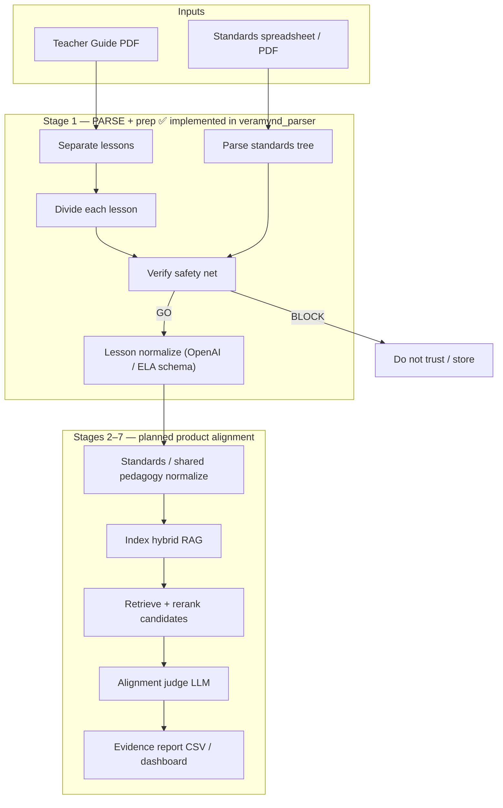
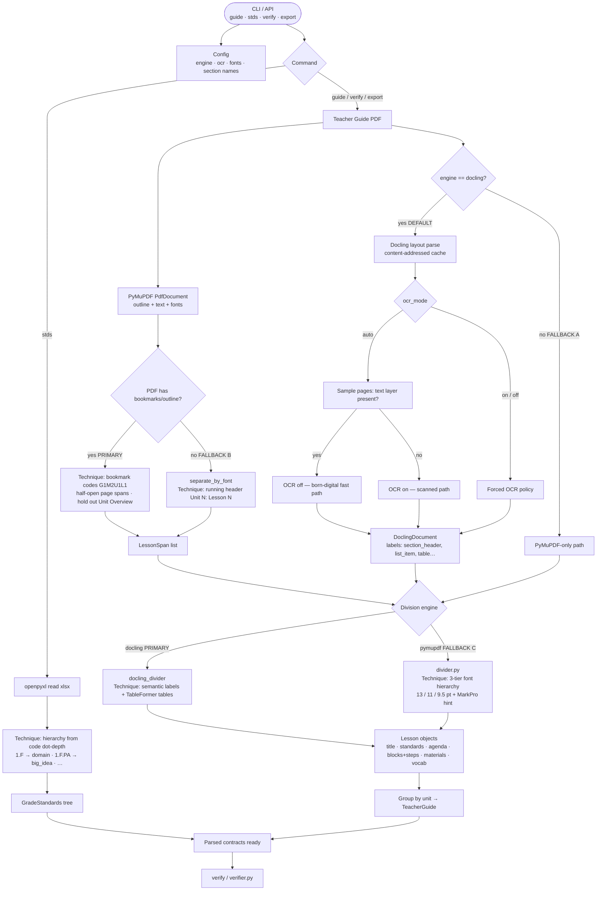
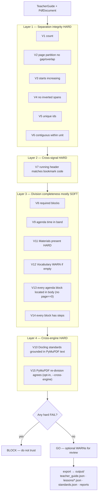

# Veramynd — Complete Project Flow

How the system works end-to-end: techniques used, fallbacks, and where they apply.

> **Official expanded documentation:** see [`complete-project-flow.md`](complete-project-flow.md)  
> (architecture, Stage 1 deep dive, validation, install, troubleshooting — suitable for GitHub / onboarding / interviews).

**Scope today:** the full pipeline is implemented in this repo — Stage 1 parse/verify/export plus normalize (lessons + standards), chunk, embed (Qdrant), hybrid retrieve + rerank, LLM judge with grounding, and CSV/HTML reporting, all wired as `veramynd-parser` CLI subcommands. [`docs/pipeline-review.md`](pipeline-review.md) describes the shipped path; [`architecture.md`](architecture.md) is the original design doc and differs from the code in places (notably it proposed Postgres+pgvector where the code ships Qdrant).

---

## 1. Full product (architecture vision)



| Stage | Role | Status in this repo |
|---|---|---|
| 1 Parse + prep | Separate + divide lessons; standards tree; verify; export; **ELA lesson normalize** | **Implemented** |
| 2–3 Product extract / normalize | Standards-side normalize + shared pedagogy vocab for the judge | Planned |
| 4–5 KB / retrieve | Hybrid RAG + rerank | Planned |
| 6 Judge | Alignment rubric (LLM) | Planned |
| 7 Report | Evidence CSV / dashboard | Planned |

---

## 2. Stage 1 parser — end-to-end (techniques + fallbacks)



### Key modules

| Step | Module | Technique |
|---|---|---|
| Config | `config.py` | One immutable `Config` (engine, OCR, fonts, section names) |
| PDF adapter | `pdf/document.py` | PyMuPDF: outline, page text, font spans |
| Separation | `pdf/separator.py` | Bookmarks → lesson page spans |
| Docling parse | `pdf/docling_parser.py` | Layout + tables; content-addressed `.docling_cache/` |
| Division (primary) | `pdf/docling_divider.py` | Semantic labels → agenda, blocks, steps, materials |
| Division (fallback) | `pdf/divider.py` + `fonts.py` | 3-tier font hierarchy |
| Orchestration | `pdf/teacher_guide.py` | `parse_teacher_guide(path, cfg) → TeacherGuide` |
| Standards | `standards/spreadsheet.py` | openpyxl; level from code dot-depth |
| Contracts | `models.py` | Pydantic: `Lesson`, `TeacherGuide`, `GradeStandards`, … |
| CLI | `cli.py` | `guide` / `stds` / `verify` / `export` |

---

## 3. Verifier safety net (gate before trust)



Module: `verify/verifier.py`. Full check catalog (V0–V15) and the `page == 0`
sentinel: `docs/complete-project-flow.md` §9.6.

| Severity | Meaning |
|---|---|
| **FAIL** (hard) | Structural violation → **BLOCK** |
| **WARN** (soft) | Plausible anomaly → still **GO**, flag for review |

`veramynd-parser export` enforces `BLOCK` itself: trusted output is withheld
(only `verification_report.txt` is written) unless `--allow-block` is passed.

---

## 4. Fallback cheat-sheet

| Where | Primary technique | Fallback | When triggered |
|---|---|---|---|
| **OCR** | Skip if text layer exists (`ocr_mode=auto`) | Turn OCR on | Scanned / image-only pages |
| **Separation** | PDF bookmarks `G#M#U#L#` | `separate_by_font` via running header `Unit N: Lesson N` | No outline / bookmarks |
| **Division** | Docling semantic labels + TableFormer | PyMuPDF 3-tier fonts (`Config(engine="pymupdf")`) | No Docling / lite install / explicit engine |
| **Standards tree** | Hierarchy from **code dot-depth** | — (Notes column ignored) | Spreadsheet Notes mostly empty |
| **Trust** | Verifier **GO** | **BLOCK** on any hard FAIL | Bad separation, missing materials, ungrounded standards, etc. |
| **Content audit** *(optional scripts)* | Fuzzy match JSON ↔ PDF text | — | `scripts/verify_content.py` — validation only, not part of parse |

---

## 5. Data contracts (what flows between stages)

```
PDF / XLSX
    │
    ▼
TeacherGuide          GradeStandards
  └─ Unit[]             └─ Standard[]  (parent_code links = tree)
       └─ Lesson[]
            ├─ declared_standards[]   ← publisher claim (e.g. CCSS RL.1.1)
            ├─ learning_targets[]
            ├─ agenda[]               ← plan (cover ToC)
            ├─ instructional_blocks[] ← body + steps (evidence)
            ├─ materials[]
            ├─ vocabulary[]
            └─ tables[]
    │
    ▼
VerificationReport → GO | BLOCK
    │
    ▼
output/  (export)
  ├─ teacher_guide.json
  ├─ lessons/<code>.json
  ├─ lessons_index.tsv
  ├─ standards.json
  └─ verification_report.txt
```

**Important:** guide standards (`RL.1.1`) and Georgia codes (`1.F.PA.4.d`) are kept **separate**. The parser never joins them on the code string.

---

## 6. One-line story

**PDF in → PyMuPDF finds lesson boundaries (bookmarks, else headers) → Docling (else fonts) fills each lesson → standards xlsx becomes a tree → verifier cross-checks → only GO output is trusted → Stage 1 normalizes lessons (ELA schema) → later stages (planned) judge alignment with evidence.**

---

## 7. How to run the implemented path

```bash
cd veramynd_parser
pip install -e '.[test]'

# Parse + safety net
veramynd-parser verify "../data/samples/ELA Grade 1 Module 2 Teacher Guide.pdf" --expect 40

# Write all artifacts
veramynd-parser export "../data/samples/ELA Grade 1 Module 2 Teacher Guide.pdf" \
  --out output --expect 40 \
  --standards "../data/samples/Grade 1 GA ELA Standards.xlsx"

# Stage 1 prep (OpenAI ELA curriculum normalize)
veramynd-parser normalize-lessons output/stage1/lessons --out output/normalize
```

On Windows, if printing the verify report fails on Unicode arrows:

```bash
set PYTHONUTF8=1
```

---

## 8. Related docs

| Doc | Topic |
|---|---|
| [`architecture.md`](architecture.md) | Full Stages 1–7 product design |
| [`ingestion.md`](ingestion.md) | Ingestion pipeline |
| [`lesson-segmentation.md`](lesson-segmentation.md) | Separation + division design |
| [`../veramynd_parser/README.md`](../veramynd_parser/README.md) | Package install and CLI |

---

*Generated as a project reference. Diagrams render in GitHub / VS Code markdown preview (Mermaid).*
